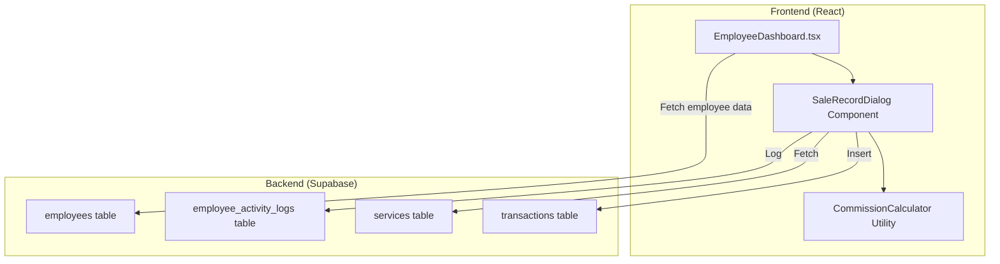

# Design Document: Employee Sales Recording

## Overview

This feature extends the Employee Dashboard to allow employees to record their own sales transactions. The implementation reuses the existing transaction recording pattern from BusinessDashboard while adapting it for the employee context. The employee's business unit and commission settings are automatically applied, simplifying the recording process.

## Architecture

The feature follows the existing React + Supabase architecture:



## Components and Interfaces

### SaleRecordDialog Component

A reusable dialog component for recording sales, extracted to be used in both Employee and Business dashboards.

```typescript
interface SaleRecordDialogProps {
  open: boolean;
  onOpenChange: (open: boolean) => void;
  employeeId: string;
  businessId: string;
  commissionType: 'percentage' | 'fixed';
  commissionPercentage: number;
  fixedCommission: number;
  onSuccess?: () => void;
}
```

### Commission Calculator Utility

A pure function for calculating commission amounts:

```typescript
interface CommissionInput {
  saleAmount: number;
  commissionType: 'percentage' | 'fixed';
  commissionPercentage: number;
  fixedCommission: number;
}

interface CommissionResult {
  commission: number;
  houseAmount: number;
}

function calculateCommission(input: CommissionInput): CommissionResult;
```

### Service Fetching Hook

```typescript
interface UseServicesOptions {
  businessId: string;
  activeOnly?: boolean;
}

interface UseServicesResult {
  services: Service[];
  loading: boolean;
  error: Error | null;
}

function useServices(options: UseServicesOptions): UseServicesResult;
```

## Data Models

### Transaction (existing)

```typescript
interface Transaction {
  id: string;
  business_id: string;
  employee_id: string;
  service_id: string;
  total_amount: number;
  commission_amount: number;
  house_amount: number;
  is_commission_paid: boolean;
  created_at: string;
  notes?: string;
}
```

### Service (existing)

```typescript
interface Service {
  id: string;
  business_id: string;
  name: string;
  base_price: number;
  is_active: boolean;
}
```

### Employee (existing)

```typescript
interface Employee {
  id: string;
  business_id: string;
  name: string;
  commission_type: 'percentage' | 'fixed';
  commission_percentage: number;
  fixed_commission: number;
}
```


## Correctness Properties

*A property is a characteristic or behavior that should hold true across all valid executions of a system-essentially, a formal statement about what the system should do. Properties serve as the bridge between human-readable specifications and machine-verifiable correctness guarantees.*

### Property 1: Service price auto-population

*For any* service selected from the dropdown, the sale amount field SHALL be populated with that service's base_price value.

**Validates: Requirements 1.2**

### Property 2: Percentage commission calculation

*For any* sale amount and employee with commission_type "percentage", the calculated commission SHALL equal `sale_amount × commission_percentage / 100`, and house_amount SHALL equal `sale_amount - commission`.

**Validates: Requirements 2.2**

### Property 3: Fixed commission calculation

*For any* sale amount and employee with commission_type "fixed", the calculated commission SHALL equal the employee's fixed_commission value regardless of sale amount, and house_amount SHALL equal `sale_amount - fixed_commission`.

**Validates: Requirements 2.3**

### Property 4: Business unit association

*For any* transaction created by an employee, the transaction's business_id SHALL equal the employee's business_id.

**Validates: Requirements 3.1**

### Property 5: Activity logging on sale

*For any* successfully recorded sale, an activity log entry SHALL be created with employee_id matching the recording employee and action equal to "sale_recorded".

**Validates: Requirements 3.3**

### Property 6: Service filtering by business unit

*For any* employee viewing the sale recording dialog, the services list SHALL contain only services where is_active is true AND business_id equals the employee's business_id.

**Validates: Requirements 4.1**

## Error Handling

| Error Scenario | Handling Strategy |
|----------------|-------------------|
| No services available | Display informative message, disable submit button |
| Service fetch fails | Show error toast, allow retry |
| Transaction insert fails | Show error toast with message, keep dialog open for retry |
| Activity log fails | Log to console, do not block transaction (non-critical) |
| Invalid sale amount (≤0) | Disable submit button, show validation message |
| Network error | Show connection error toast, allow retry |

## Testing Strategy

### Property-Based Testing

The implementation will use **fast-check** as the property-based testing library for TypeScript/JavaScript.

Each property-based test MUST:
- Run a minimum of 100 iterations
- Be tagged with a comment referencing the correctness property: `**Feature: employee-sales-recording, Property {number}: {property_text}**`
- Test the core logic in isolation where possible

### Unit Tests

Unit tests will cover:
- Dialog rendering with correct form fields
- Form validation (empty service, invalid amount)
- Submit button disabled states
- Error message display

### Test File Structure

```
src/test/
├── employee-sales-recording.property.test.ts  # Property-based tests
└── SaleRecordDialog.test.tsx                  # Unit tests for dialog component
```

### Key Test Scenarios

1. Commission calculation for percentage type with various amounts
2. Commission calculation for fixed type with various amounts
3. Service filtering returns only active services for correct business
4. Transaction creation includes all required fields
5. Activity log creation on successful sale
