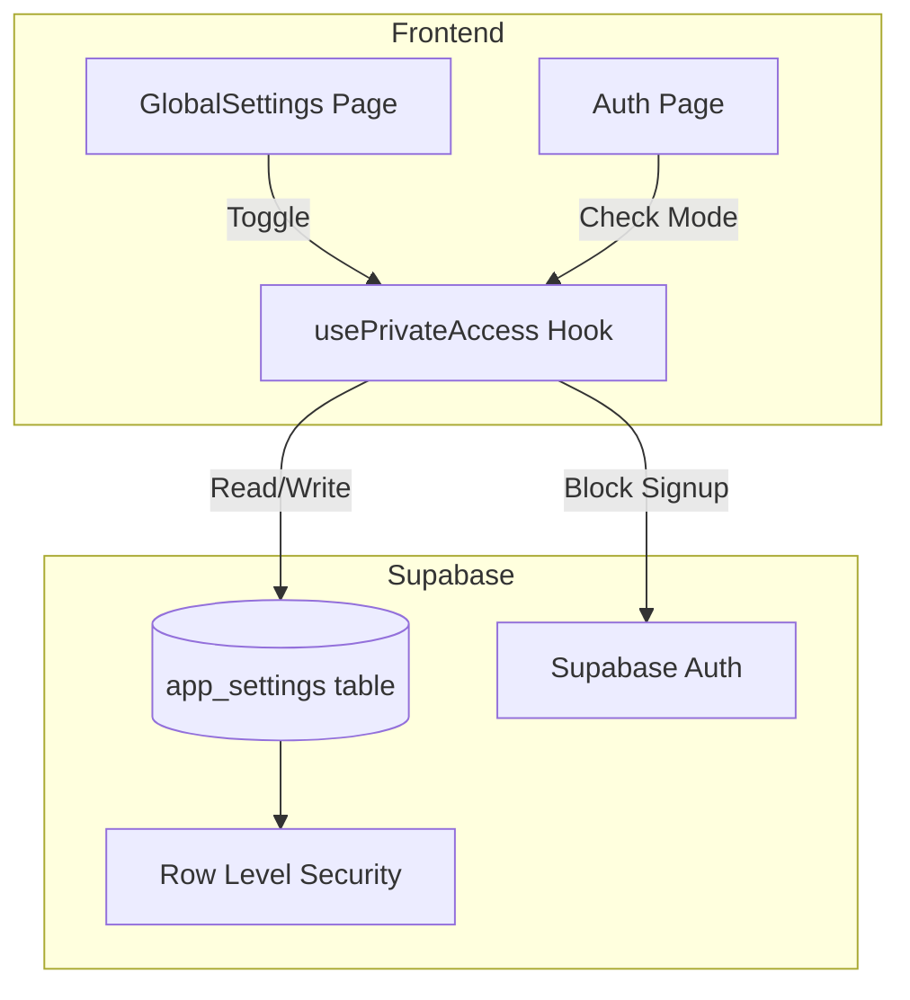

# Design Document: Private Access Toggle

## Overview

The Private Access Toggle feature enables administrators to restrict public registration by toggling a system-wide setting. When enabled, the signup page redirects to login, signup links are hidden, and the registration API rejects new signups. The setting is persisted in a Supabase `app_settings` table with Row Level Security ensuring only admins can modify it.

## Architecture



### Data Flow

1. **Admin toggles setting**: GlobalSettings → usePrivateAccess hook → app_settings table
2. **User visits Auth page**: Auth page → usePrivateAccess hook → conditional render/redirect
3. **User attempts signup**: useAuth hook → checks private access → blocks or allows Supabase Auth call

## Components and Interfaces

### 1. Database: `app_settings` Table

A new table to store application-wide configuration.

```sql
CREATE TABLE public.app_settings (
  id UUID PRIMARY KEY DEFAULT gen_random_uuid(),
  key TEXT UNIQUE NOT NULL,
  value JSONB NOT NULL,
  updated_at TIMESTAMPTZ DEFAULT now()
);
```

### 2. Hook: `usePrivateAccess`

A React hook to manage private access state.

```typescript
interface UsePrivateAccessReturn {
  isPrivateAccessEnabled: boolean;
  isLoading: boolean;
  error: Error | null;
  setPrivateAccess: (enabled: boolean) => Promise<void>;
}

function usePrivateAccess(): UsePrivateAccessReturn;
```

### 3. Modified Hook: `useAuth`

The existing `useAuth` hook will be modified to check private access before allowing signup.

```typescript
// Modified signUp function signature (unchanged externally)
const signUp = async (email: string, password: string, fullName?: string) => {
  // Check private access mode before proceeding
  // Return error if private access is enabled
};
```

### 4. UI Component: Access Control Section

A new section in GlobalSettings with a toggle switch.

```typescript
interface AccessControlSectionProps {
  isEnabled: boolean;
  isLoading: boolean;
  onToggle: (enabled: boolean) => void;
}
```

### 5. Modified Auth Page

The Auth page will:
- Fetch private access status on mount
- Redirect to login view if private access is enabled and user tries to access signup
- Hide "Sign up" links when private access is enabled

## Data Models

### AppSetting

```typescript
interface AppSetting {
  id: string;
  key: string;
  value: unknown; // JSONB - type depends on key
  updated_at: string;
}

// For private_access_enabled key
interface PrivateAccessSetting extends AppSetting {
  key: 'private_access_enabled';
  value: boolean;
}
```

### Constants

```typescript
const APP_SETTING_KEYS = {
  PRIVATE_ACCESS_ENABLED: 'private_access_enabled',
} as const;
```

## Correctness Properties

*A property is a characteristic or behavior that should hold true across all valid executions of a system-essentially, a formal statement about what the system should do. Properties serve as the bridge between human-readable specifications and machine-verifiable correctness guarantees.*

### Property 1: Toggle Persistence Consistency

*For any* toggle state (enabled or disabled), when an admin changes the Private Access setting, the database should reflect that exact state after the operation completes.

**Validates: Requirements 1.2, 1.3**

### Property 2: Signup Redirect Enforcement

*For any* navigation attempt to the signup view when Private Access Mode is enabled, the system should redirect the user to the login view.

**Validates: Requirements 2.1**

### Property 3: Signup API Rejection

*For any* signup request (via signUp function or direct API call) when Private Access Mode is enabled, the system should reject the request and return an error indicating registration is disabled.

**Validates: Requirements 3.1, 3.2**

### Property 4: RLS Admin-Only Modification

*For any* non-admin authenticated user, attempting to update or insert records in the app_settings table should be rejected by Row Level Security policies.

**Validates: Requirements 5.3**

## Error Handling

| Scenario | Handling |
|----------|----------|
| Database unavailable during setting fetch | Default to `false` (allow registration), log error |
| Database unavailable during setting update | Show error toast, revert toggle UI state |
| Setting not found in database | Default to `false` (allow registration) |
| Non-admin attempts to modify setting | RLS rejects, show permission error |
| Signup attempted when private access enabled | Return error: "Registration is currently disabled" |

## Testing Strategy

### Property-Based Testing Library

We will use **fast-check** for property-based testing in TypeScript/JavaScript.

### Unit Tests

1. **usePrivateAccess hook**
   - Returns correct initial state
   - Updates state after toggle
   - Handles database errors gracefully

2. **Auth page**
   - Renders login view by default
   - Hides signup link when private access enabled
   - Shows signup link when private access disabled

3. **useAuth signUp function**
   - Returns error when private access enabled
   - Proceeds normally when private access disabled

### Property-Based Tests

Each property-based test MUST:
- Run a minimum of 100 iterations
- Be tagged with a comment referencing the correctness property: `**Feature: private-access-toggle, Property {number}: {property_text}**`

1. **Property 1 Test**: Generate random boolean states, toggle to each state, verify database matches
2. **Property 2 Test**: Generate random navigation scenarios with private mode enabled, verify redirect occurs
3. **Property 3 Test**: Generate random signup payloads with private mode enabled, verify rejection
4. **Property 4 Test**: Generate random non-admin user contexts, verify RLS blocks modifications

### Integration Tests

1. End-to-end flow: Admin enables private access → User cannot sign up → Admin disables → User can sign up
2. Persistence: Enable private access → Refresh page → Setting remains enabled
